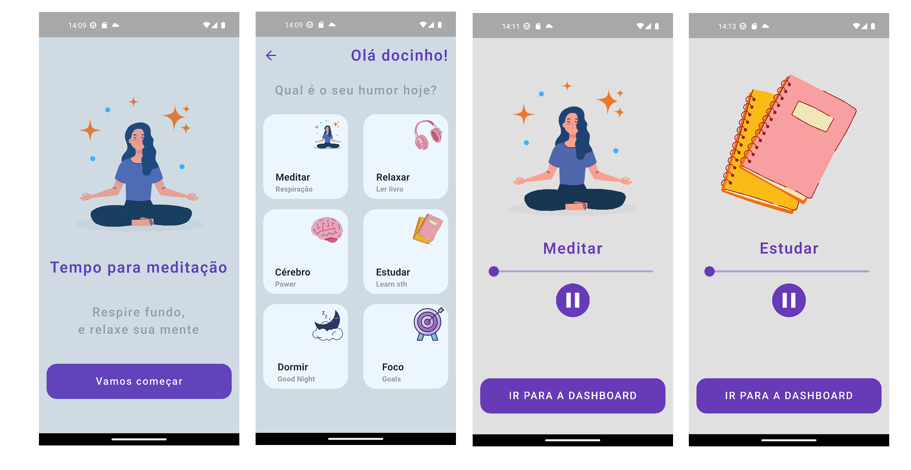

# App Meditação

Um aplicativo que deixa você calmo, aliviado, relaxado e focado 🧘

### Screens



### Características

- Reproduzir, retomar, parar músicas de acordo com sua escolha
- English / Portugues linguagem
- IU simples e bonita

### Pakages

- audioplayer - para reprodutor de música

### Autor

[caneto](https://github.com/caneto/)


### Uso

```bash
# Clonar este repositório
$ git clone https://github.com/caneto/app_meditacao.git

# Instalar dependencias
$ flutter packages get

# Execute o aplicativo
$ flutter run
```
